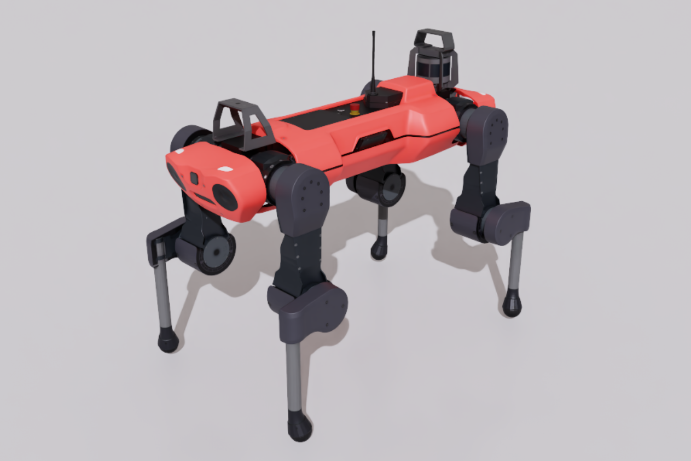

# ANYmal C Robot Simulation Assets

## Overview

This package contains robot assets for the [ANYmal C robot](https://www.anybotics.com/anymal) developed by [ANYbotics](https://www.anybotics.com).

The subfolders contain:

- **usd**: Universal Scene Description format files
- **urdf**: Robot description format files that reference files in
- **meshes**: Mesh and texture data for the URDF description
- **rl_policies**: Pre-trained reinforcement learning policies for locomotion

## Sources

### USD

The USD model was collected using IsaacSim from the IsaacLab robot assets. The specific source URLs are available in the [collection record](usd/.collect.mapping.json).

For changes made to the model for simulation in Newton, please refer to the Git commit history of this folder.

### URDF

The URDF and mesh files were retrieved from https://github.com/ANYbotics/anymal_c_simple_description at 87b6851. In the URDF, the mesh paths were updated to match the asset folder name.

## License

This model is released under a [BSD-3-Clause License](LICENSE).
