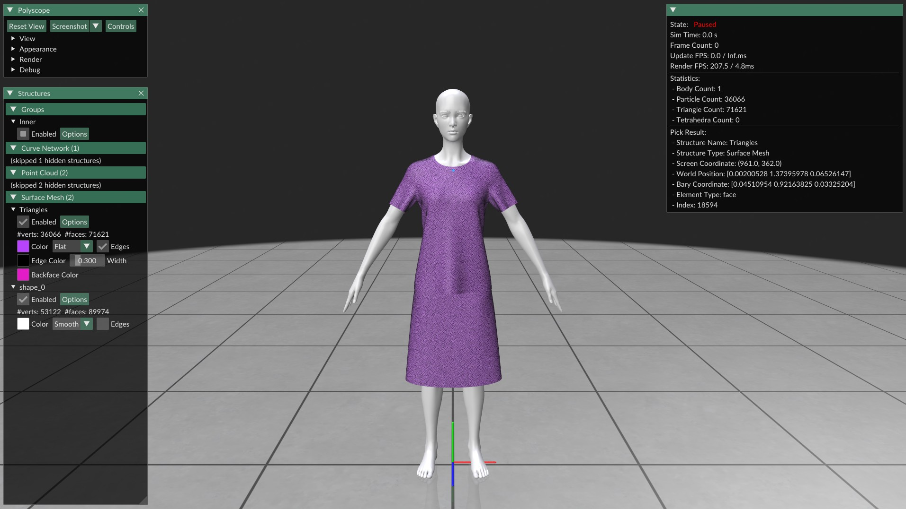
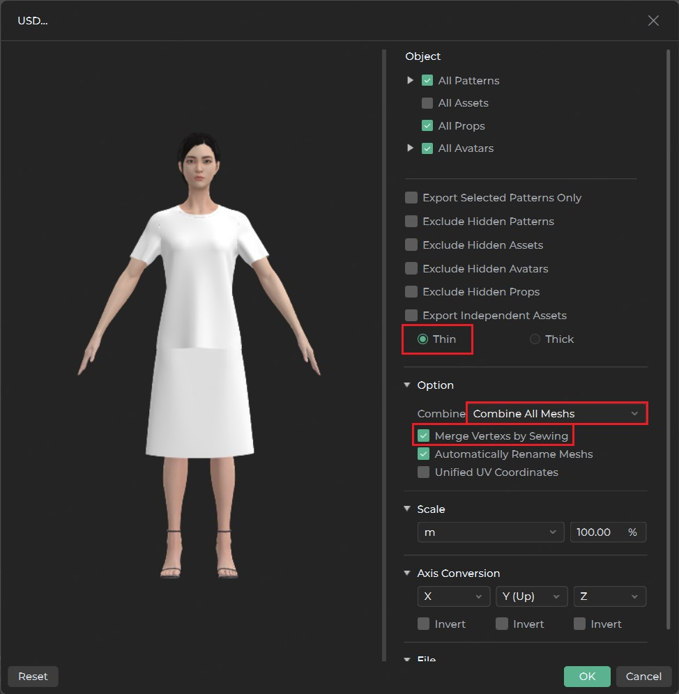

# Style3D USD Format Specification

## Overview
This package includes assets exported from [Style3D Studio](https://style3d.com).

<p align="center">
  
</p>

Note: The USD format preserves both 3D garment geometry and 2D pattern information.

## Data Structure
Exported garments from Style3D Studio include:
- 3D Geometry
  - Merged vertex positions in 3D space
  - Triangle indices for 3D mesh construction
- 2D Pattern Data
  - Unmerged vertices in material (UV) space (always stored in millimeters)
  - Triangle indices for 2D pattern layout

## Usages
```python
import numpy as np
from pxr import Usd, UsdGeom

# Load USD file
usd_stage = Usd.Stage.Open("xxx.usd")
usd_geom = UsdGeom.Mesh(usd_stage.GetPrimAtPath("/Root/xxx/Root_Garment"))
usd_prim = UsdGeom.PrimvarsAPI(usd_geom.GetPrim()).GetPrimvar("st")

# Extract 3D geometry
vertices_3d = np.array(usd_geom.GetPointsAttr().Get())
indices_3d = np.array(usd_geom.GetFaceVertexIndicesAttr().Get())

# Extract 2D pattern data (convert mm to meters)
indices_2d = np.array(usd_prim.GetIndices())
vertices_2d = np.array(usd_prim.Get()) * 1e-3
```

## Guide in Style3D Studio
To properly export garments with 2D/3D correspondence:
1. Navigate to: File -> Export -> USD
2. ​​Critical Settings​​ (see red boxes in image below)
<p align="center">
  
</p>
