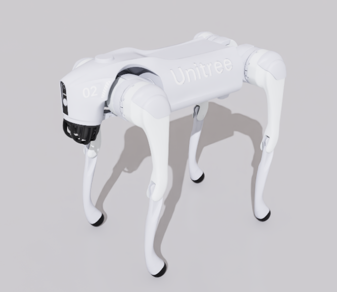

# Unitree Go2 Robot Simulation Assets

## Overview

This package contains robot assets for the [Go2](https://www.unitree.com/go2) developed by [Unitree](https://www.unitree.com/).

The subfolders contain:

- **usd**: Universal Scene Description format files
- **rl_policies**: Pre-trained reinforcement learning policies for locomotion

## Sources

### USD

The USD model was collected using IsaacSim from the IsaacLab robot assets. The specific source URLs are available in the [collection record](usd/.collect.mapping.json).

For changes made to the model for simulation in Newton, please refer to the Git commit history of this folder.

## License

This model is released under a [BSD-3-Clause License](LICENSE).
