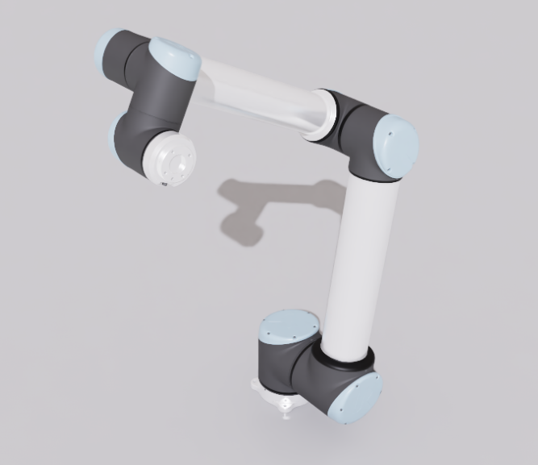

# Universal Robots UR10 Simulation Assets

## Overview

This folder contains robot assets for the UR10 developed by [Universal Robots](https://www.universal-robots.com/).

## Sources

### USD

The USD model was collected using IsaacSim from the IsaacLab robot assets. The specific source URLs are available in the [collection record](usd/.collect.mapping.json).

For changes made to the model for simulation in Newton, please refer to the Git commit history of this folder.

## License

This model is released under a [BSD-3-Clause License](LICENSE).
